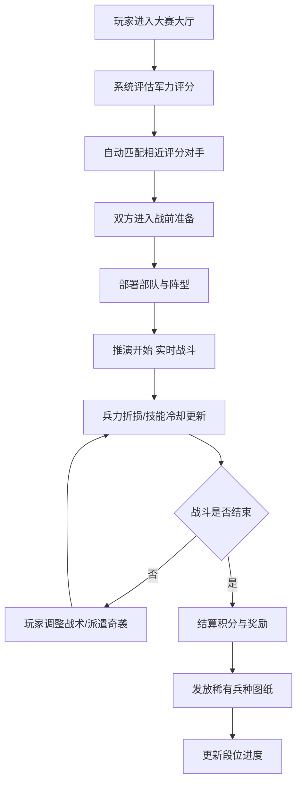
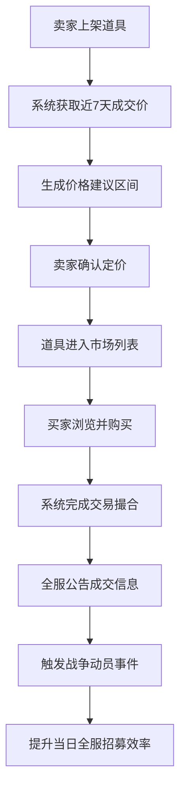

## 1. 产品概述

多人在线魔法世界战争推演沙盘与虚拟战争大赛系统，玩家可创建军团、招募将领、配置兵种，在沙盘上推演战争、参加每日大赛、交易稀有道具、升级联合军部，体验完整的魔法战争策略游戏。

- 核心目标：打造沉浸式的策略战争推演平台，支持数千玩家同时竞技
- 目标用户：策略游戏爱好者、沙盘推演玩家、多人在线竞技玩家
- 市场价值：填补魔法题材战争策略游戏的空白，结合实时推演与社交交易

## 2. 核心功能

### 2.1 用户角色与军团权限

| 角色 | 获取方式 | 核心权限 |
|------|---------|---------|
| 军团长 | 创建军团者自动担任 | 审批新兵晋升、发起兵种研发、管理军团成员、解散军团 |
| 副军团长 | 军团长任命 | 协助审批、组织活动、管理后勤、指挥战争 |
| 后勤官 | 军团长/副军团长任命 | 管理物资、处理交易申请、维护补给线、升级军部 |
| 普通成员 | 申请加入审批通过 | 参与战争、贡献材料、交易道具、参加大赛 |

### 2.2 功能模块

1. **首页仪表盘**：军团概览、战力雷达、大赛通知、活动入口
2. **军团管理**：成员管理、权限分配、新兵审批、研发立项
3. **兵种配置**：将领招募、士兵编制、兵种搭配、战力计算
4. **沙盘推演**：部队部署、阵型设置、地形天气、实时推演
5. **战争大赛**：每日匹配、实时战斗、兵力折损、战术技能
6. **交易市场**：图纸交易、合同拍卖、系统定价建议、全服公告
7. **联合军部**：升级系统、贡献机制、战力上限、战场视野
8. **战争报告**：产业报告、热力图、胜率曲线、PDF导出
9. **全服排行榜**：军团战力、大赛积分、公会贡献排名

### 2.3 页面详情

| 页面名称 | 模块名称 | 功能描述 |
|---------|---------|---------|
| 首页仪表盘 | 战力概览卡片 | 显示军团总战力、兵种构成、士气补给状态 |
| 首页仪表盘 | 战争动态区 | 滚动显示全服战报、交易公告、动员事件 |
| 首页仪表盘 | 大赛倒计时 | 显示每日大赛开放时间、匹配状态 |
| 首页仪表盘 | 快捷入口 | 常用功能快捷跳转按钮组 |
| 军团管理 | 成员列表 | 按军衔排序的成员列表、贡献值显示 |
| 军团管理 | 审批中心 | 新兵申请、晋升申请、研发申请审批 |
| 军团管理 | 权限管理 | 三级权限分配界面、职务任免 |
| 兵种配置 | 将领大厅 | 招募将领、查看属性、培养升级 |
| 兵种配置 | 编制面板 | 步骑法三军编制、兵力调整、装备分配 |
| 兵种配置 | 战力计算器 | 实时计算综合战力、兵种加成、地形修正 |
| 沙盘推演 | 战术沙盘 | 六边形网格地图、部队拖拽部署 |
| 沙盘推演 | 阵型编辑器 | 进攻/防御阵型预设、自定义阵型保存 |
| 沙盘推演 | 天气地形 | 随机/手动设置天气、地形类型选择 |
| 战争大赛 | 匹配大厅 | 军力评分匹配、对手信息预览 |
| 战争大赛 | 实时战场 | 双方兵力对比、阵型完整度、技能冷却 |
| 战争大赛 | 战术操作 | 手动调整阵型、派遣奇袭部队、释放技能 |
| 战争大赛 | 结算奖励 | 积分结算、稀有图纸发放、段位进度 |
| 交易市场 | 兵种图纸市场 | 图纸列表、价格区间、搜索筛选 |
| 交易市场 | 将领合同市场 | 合同拍卖、竞价机制、成交记录 |
| 交易市场 | 我的交易 | 出售上架、购买历史、收入统计 |
| 联合军部 | 升级界面 | 军部等级、全员贡献进度、升级效果预览 |
| 联合军部 | 贡献面板 | 材料捐赠、金币捐赠、个人贡献统计 |
| 战争报告 | 产业概览 | 兵种使用率热力图、大赛胜率曲线图 |
| 战争报告 | 交易走势 | 成交均价曲线、热门道具排行 |
| 战争报告 | PDF导出 | 军团战力雷达图、战役趋势图、一键导出 |
| 排行榜 | 战力榜 | 全服军团战斗力排名、前后10名高亮 |
| 排行榜 | 积分榜 | 赛季大赛积分排行、段位显示 |
| 排行榜 | 贡献榜 | 公会贡献度排行、贡献明细 |

## 3. 核心流程

### 3.1 主要用户流程

玩家首次登录 → 创建/加入军团 → 招募将领配置兵种 → 沙盘部署练习 → 参加每日战争大赛 → 获取奖励升级军团 → 交易图纸/合同 → 升级联合军部 → 赛季末获取限定军旗

### 3.2 战争大赛核心流程

### 3.3 交易成交流程

## 4. 用户界面设计

### 4.1 设计风格

- **主色调**：深邃紫蓝 `#1a0a2e` 配金色装饰 `#d4af37`，辅以魔法蓝 `#4fc3f7` 和火焰橙 `#ff6b35`
- **辅色调**：深灰 `#252525`、血红色 `#c62828`（损失）、翠绿色 `#2e7d32`（增益）
- **按钮风格**：棱角分明的魔法符文边框，悬浮时金色光晕脉动，点击时符文闪烁
- **字体**：标题使用 Cinzel（古典衬线魔法风），正文使用 Lora（优雅衬线），数据使用 JetBrains Mono（等宽清晰）
- **布局风格**：深色魔法主题，多层级卡片叠加，六边形战术网格，动态粒子背景
- **图标风格**：手绘魔法符文图标，带发光效果的兵种符号，动态天气图标

### 4.2 页面设计概述

| 页面名称 | 模块名称 | UI 元素与风格 |
|---------|---------|--------------|
| 首页仪表盘 | 战力概览 | 六边形战力雷达图，金色边框发光，数值动态跳动 |
| 首页仪表盘 | 战争动态 | 竖向滚动战报，新消息红色符文标记，背景光效流动 |
| 沙盘推演 | 战术地图 | 六边形网格地形，不同地貌颜色区分，部队棋子发光 |
| 沙盘推演 | 阵型面板 | 拖拽式阵型编辑，预设阵型卡片，连线显示部队协同 |
| 战争大赛 | 实时战场 | 左右分栏对比双方，中间战斗动画，底部技能冷却条 |
| 战争大赛 | 战术操作 | 符文按钮组，冷却进度环，奇袭路径动画 |
| 交易市场 | 道具卡片 | 稀有度边框颜色，价格浮动箭头，建议区间半透明条 |
| 联合军部 | 升级进度 | 环形进度条，全员贡献累计，升级奖励预览浮层 |
| 战争报告 | 数据图表 | 深色背景热力图，渐变色胜率曲线，可交互数据点 |
| 排行榜 | 排名列表 | 前3名特殊奖杯图标，段位徽章，升降箭头动画 |

### 4.3 响应式设计

- **桌面优先**：1920px 为基准设计，支持大屏多信息列展示
- **平板适配**：1024px-1440px，侧边栏折叠为图标模式，卡片两列布局
- **手机适配**：768px 以下，底部 Tab 导航，单列瀑布流，沙盘简化显示
- **触控优化**：拖拽区域增大，按钮最小 48px，手势缩放地图

### 4.4 视觉特效与动效

- **背景层**：动态魔法粒子漂浮，星座连线闪烁，战场烟雾纹理
- **入场动画**：页面加载时符文圈扩散，卡片依次 staggered 滑入
- **战斗特效**：技能释放时粒子爆炸，兵力减员时红色碎裂效果
- **微交互**：悬停时卡片上浮+阴影加深，数值变化时滚动计数
- **通知系统**：全服公告从顶部滑入，重要消息金色边框脉冲
