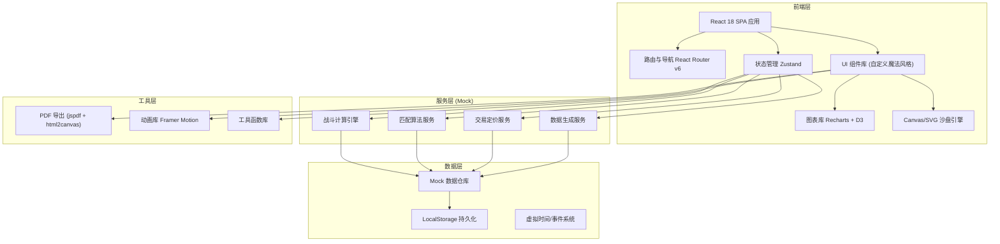

## 1. 架构设计



## 2. 技术描述

- **前端框架**：React@18.2 + TypeScript@5.2
- **构建工具**：Vite@5.0（极速热更新、优化打包）
- **样式方案**：TailwindCSS@3.4 + CSS Variables（魔法主题系统）
- **状态管理**：Zustand@4.4（轻量、无模板、支持中间件持久化）
- **路由管理**：React Router v6.20
- **图表可视化**：Recharts@2.10（胜率曲线、走势图）+ D3@7.8（热力图、雷达图）
- **动画库**：Framer Motion@10.16（入场动画、微交互、战斗特效）
- **PDF导出**：jsPDF@2.5 + html2canvas@1.4（战役报告导出）
- **数据持久化**：LocalStorage + Zustand Persist Middleware
- **代码规范**：ESLint + Prettier + Husky (可选)

## 3. 路由定义

| 路由路径 | 页面组件 | 功能描述 |
|---------|---------|---------|
| `/` | `DashboardPage` | 首页仪表盘，军团概览与快捷入口 |
| `/legion` | `LegionPage` | 军团管理，成员/权限/审批中心 |
| `/barracks` | `BarracksPage` | 兵种配置，将领招募与编制 |
| `/sandbox` | `SandboxPage` | 沙盘推演，战术部署与练习 |
| `/arena` | `ArenaPage` | 战争大赛，匹配与实时战斗 |
| `/arena/battle/:id` | `BattlePage` | 具体对战页面，实时战斗界面 |
| `/market` | `MarketPage` | 交易市场，图纸与合同交易 |
| `/headquarters` | `HeadquartersPage` | 联合军部，升级与贡献 |
| `/reports` | `ReportsPage` | 战争报告，数据分析与PDF导出 |
| `/ranking` | `RankingPage` | 全服排行榜，三类榜单展示 |

## 4. 核心数据模型与类型定义

```typescript
// 玩家信息
interface Player {
  id: string;
  name: string;
  avatar: string;
  title: string;
  rank: RankTier;
  seasonPoints: number;
  gold: number;
  materials: Record<string, number>;
  legionId: string | null;
  legionRole: LegionRole | null;
}

// 军团
interface Legion {
  id: string;
  name: string;
  slogan: string;
  banner: BannerConfig;
  commanderId: string;
  viceCommanderIds: string[];
  quartermasterIds: string[];
  members: LegionMember[];
  headquarters: Headquarters;
  researchProjects: ResearchProject[];
  totalPower: number;
  contribution: number;
  createdAt: number;
}

// 军团成员
interface LegionMember {
  playerId: string;
  playerName: string;
  role: LegionRole;
  joinedAt: number;
  contribution: number;
  armyPower: number;
}

// 联合军部
interface Headquarters {
  level: number;
  maxLevel: number;
  upgradeProgress: UpgradeProgress;
  powerCapBonus: number;
  visionBonus: number;
  effects: HeadquartersEffect[];
}

// 将领
interface General {
  id: string;
  name: string;
  portrait: string;
  rarity: Rarity;
  level: number;
  exp: number;
  skills: GeneralSkill[];
  traits: Trait[];
  specialty: UnitType;
  commandCap: number;
  moraleBoost: number;
  attackBonus: number;
  defenseBonus: number;
}

// 兵种单位
interface Unit {
  id: string;
  name: string;
  type: UnitType;
  rarity: Rarity;
  level: number;
  count: number;
  baseStats: UnitStats;
  equipment: Equipment[];
  blueprintId: string | null;
}

// 编制配置
interface ArmyComposition {
  infantry: UnitSlot;
  cavalry: UnitSlot;
  mages: UnitSlot;
  generalId: string | null;
  totalPower: number;
  morale: number;
  supplies: number;
}

// 阵型
interface Formation {
  id: string;
  name: string;
  type: 'offensive' | 'defensive' | 'balanced' | 'custom';
  slots: FormationSlot[];
  bonuses: FormationBonus;
}

// 战斗单位
interface BattleUnit {
  unitId: string;
  name: string;
  type: UnitType;
  initialCount: number;
  currentCount: number;
  casualties: number;
  attack: number;
  defense: number;
  hp: number;
  maxHp: number;
  position: HexCoord;
  statusEffects: StatusEffect[];
}

// 战斗状态
interface BattleState {
  id: string;
  playerArmy: BattleSide;
  enemyArmy: BattleSide;
  currentTurn: number;
  phase: 'preparation' | 'active' | 'ended';
  terrain: TerrainType;
  weather: WeatherType;
  activeSkills: ActiveSkill[];
  log: BattleLogEntry[];
  winner: 'player' | 'enemy' | 'draw' | null;
  startTime: number;
  lastUpdate: number;
}

// 交易订单
interface TradeOrder {
  id: string;
  sellerId: string;
  sellerName: string;
  itemType: 'blueprint' | 'contract' | 'material';
  itemData: TradeItem;
  price: number;
  suggestedPriceRange: [number, number];
  listedAt: number;
  expiresAt: number;
  status: 'active' | 'sold' | 'expired';
  bidHistory: BidEntry[];
}

// 大赛匹配
interface MatchmakingTicket {
  id: string;
  playerId: string;
  powerRating: number;
  tier: RankTier;
  joinedAt: number;
  estimatedWait: number;
  status: 'queued' | 'matched' | 'cancelled';
}

// 战争报告
interface WarReport {
  periodStart: number;
  periodEnd: number;
  unitUsageHeatmap: HeatmapData[];
  winRateCurve: TimeSeriesPoint[];
  priceTrends: PriceTrend[];
  topLegions: RankEntry[];
  battleStatistics: BattleStats;
}

// 类型别名
type LegionRole = 'commander' | 'vice_commander' | 'quartermaster' | 'member';
type Rarity = 'common' | 'uncommon' | 'rare' | 'epic' | 'legendary';
type UnitType = 'infantry' | 'cavalry' | 'mage';
type TerrainType = 'plain' | 'forest' | 'mountain' | 'desert' | 'swamp';
type WeatherType = 'sunny' | 'rain' | 'fog' | 'snow' | 'storm';
type RankTier = 'bronze' | 'silver' | 'gold' | 'platinum' | 'diamond' | 'master';
```

## 5. 核心算法模块说明

```
战斗计算引擎 (combatEngine.ts)
├── calculateUnitPower()     单兵种战力
├── calculateArmyPower()     军团综合战力
├── applyTerrainModifier()   地形修正系数
├── applyWeatherModifier()   天气修正系数
├── calculateMatchupBonus()  兵种克制加成
├── simulateBattleRound()    单回合战斗模拟
├── calculateCasualties()    兵力折损计算
├── updateMorale()           士气动态更新
├── consumeSupplies()        补给消耗计算
└── evaluateFormation()      阵型完整度评估

匹配算法 (matchmaker.ts)
├── calculatePowerRating()   军力评分计算
├── findMatch()              ELO 相近匹配
├── estimateWaitTime()       等待时间预估
└── updateMatchmakingPool()  匹配池维护

交易定价服务 (pricingService.ts)
├── getHistoricalPrices()    近7天历史数据
├── calculatePriceRange()    建议价格区间
├── detectMarketTrend()      市场走势分析
└── validateListingPrice()   挂单价格校验

军团贡献系统 (contributionSystem.ts)
├── calculateDonationValue() 捐赠价值换算
├── distributeRewards()      全员奖励分配
├── unlockHeadquartersBonus() 军部解锁效果
└── validateUpgradeCost()    升级成本校验
```

## 6. 目录结构设计

```
src/
├── assets/                  # 静态资源
│   ├── fonts/              # 魔法字体文件
│   ├── images/             # 背景、图标、纹理
│   └── data/               # Mock JSON 数据
├── components/             # 通用组件
│   ├── ui/                 # 基础UI (Button, Card, Modal...)
│   ├── charts/             # 图表组件
│   ├── layout/             # 布局组件
│   ├── military/           # 军事相关组件
│   └── shared/             # 业务共享组件
├── pages/                  # 页面级组件
│   ├── Dashboard/
│   ├── Legion/
│   ├── Barracks/
│   ├── Sandbox/
│   ├── Arena/
│   ├── Market/
│   ├── Headquarters/
│   ├── Reports/
│   └── Ranking/
├── store/                  # Zustand 状态仓库
│   ├── playerStore.ts
│   ├── legionStore.ts
│   ├── armyStore.ts
│   ├── battleStore.ts
│   ├── marketStore.ts
│   └── globalStore.ts
├── engines/                # 核心算法引擎
│   ├── combatEngine.ts
│   ├── matchmaker.ts
│   ├── pricingService.ts
│   ├── contributionSystem.ts
│   └── hexGridEngine.ts
├── hooks/                  # 自定义 Hooks
├── types/                  # TypeScript 类型定义
├── utils/                  # 工具函数
├── styles/                 # 全局样式与主题
└── App.tsx                 # 应用入口
```

## 7. 性能优化策略

1. **状态分片**：Zustand 多 store 拆分，避免不必要重渲染
2. **虚拟列表**：排行榜、交易列表使用 react-window 虚拟化
3. **战斗帧率控制**：Canvas 沙盘使用 requestAnimationFrame 帧同步
4. **数据防抖**：战力计算、匹配搜索使用 Debounce/Throttle
5. **代码分割**：按路由懒加载，战斗模块独立分包
6. **缓存策略**：计算结果使用 memoize-one，图表数据复用
